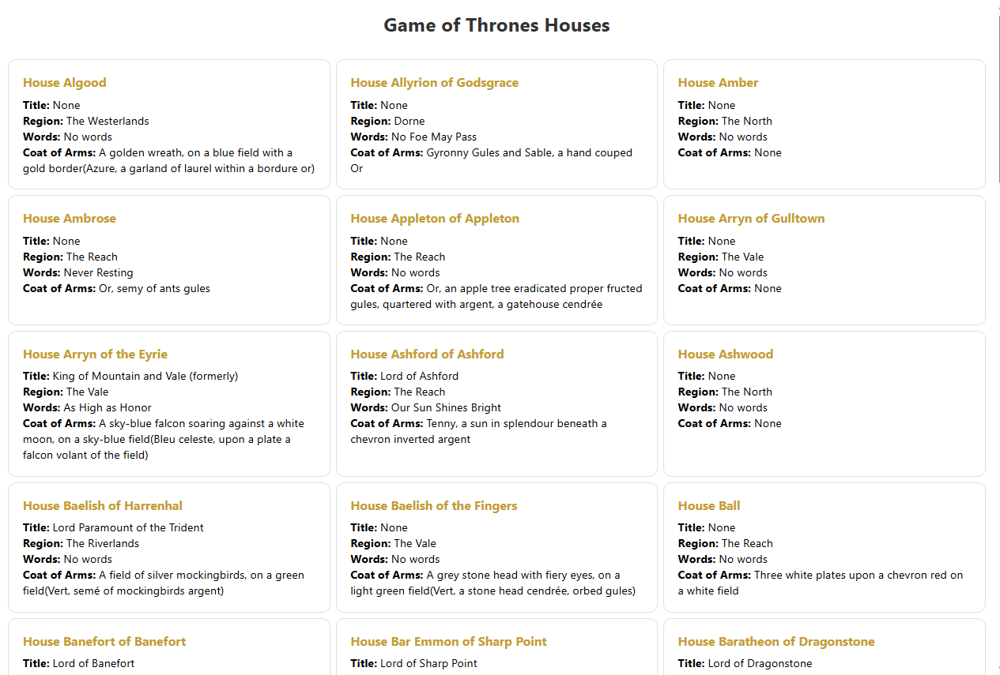
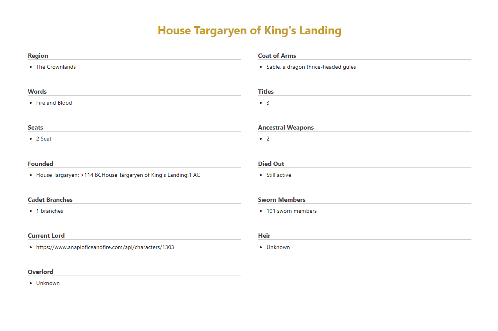

# HARTING-Angular-Coding-Challenge 🏰

A simple Angular application that displays Game of Thrones houses using the [An API of Ice And Fire](https://anapioficeandfire.com/api/). It features a clean layout, reusable components, loading states, and responsive design.

> This project was generated using [Angular CLI](https://github.com/angular/angular-cli) version 19.2.6.

---

## 📦 Features

- 🔍 List of Game of Thrones houses
- 📄 House detail view with structured data
- ⏳ Loading indicators using a reusable loader component
- 🧩 Modular and standalone component architecture
- 🎨 Clean and responsive UI with grid layout

---

## 🖼️ Screenshots

> Make sure to place your screenshots inside a `Public/` folder in your project root.

### 🏘️ House List Page


### 🏰 House Detail Page


---

## 🚀 Getting Started

### 🔧 Prerequisites

- Node.js (v18 or above recommended)
- Angular CLI

### 📥 Clone and Install

```bash
git clone https://github.com/vsartison/HARTING-Angular-Coding-Challenge.git
cd HARTING-Angular-Coding-Challenge
npm install
ng serve 
